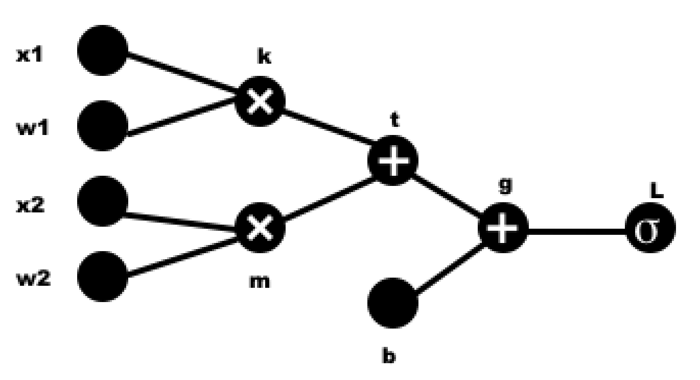

# Autograd

This repository represents a simple implementation of the autograd engine (automatic computation of the gradient of the computational graph). MLP is implemented to demostration.

The implementation is written in C++.

### Autograd files:

```cpp
"/autograd/autograd.cpp"
"/autograd/autograd.hpp"
```

The main unit of the autograd engine is the ```Variable``` class, which contains information about the value of this variable and the value of the computational graph derevative for this variable at the current value.

Any work with ```Variable``` provides with it pointer.

Declaring an object of the ```Variable```:

```cpp
std::shared_ptr<Variable<double>> variable = std::make_shared<Variable<double>>(42.0);
```

Pointer ```Variable``` supports basic arithmetic operations and long expressions (e.g. +, -, *, /, ^). More over some of activations functions (e.g. ReLU(), Tanh(), Sigmoid()) are also implemented. 

You can all use ```get_info()``` method to print information about variable (data value, grad value and additional info if specified).

```cpp
variable->get_info(); // --> Variable(data=42.0, grad=0.0, info=)
variable->add_info("some variable");
variable->get_info(); // --> Variable(data=42.0, grad=0.0, info=some variable)
```

Some of other available operations and functions are demonstrated in the [autograd_variable_test](/autograd_variable_test)

### Simple example of autograd functionality:

Let's look at a example of simple neuron



So, we have function. So, we have function $L = f(x_1, x_2, w_1, w_2, b) = \sigma(x_1w_1+x_2w_2+b)$. Let's $x_1=2.0, x_2=1.25, w_1=0.5, w_2=0.75, b=-0.5$. We can find that $L = f(2.0, 1.25, 0.5, 0.75, -0.5) \approx 0.808067$. Let's $k=x_1w_1, m=x_2w_2, t=k+m, g = t + b, L=\sigma(g)$.

So what is $\frac{dL}{dL}$? Of course 1. How can we find $\frac{dL}{dg}$? $\frac{dL}{dg} = \frac{d\sigma(g)}{dg} = \sigma(g)(1-\sigma(g))$.

But how can we find the value of this partial derevative in specific point? We need to know function value $g$.

We can easily find values of all functions step by step. 

Let's look at [autograd_forward](/autograd_forward) folder for forward.txt:
```
Variable(data=1, grad=0, info=k)
Variable(data=0.9375, grad=0, info=m)
Variable(data=1.9375, grad=0, info=t)
Variable(data=1.4375, grad=0, info=g)
Variable(data=0.808067, grad=0, info=L)

And for one line:
Variable(data=0.808067, grad=0, info=)
```

That's correct.

So we can easily find that $\frac{dL}{dg} \approx 0.155095$

When we are training neural networks we need to calculate all partial derevative to gradient oprimizer step. We can easily do it with chain rule. Let's manually calculate all partial derivatives in points and then check the backpropagation algorithm.

$\frac{dL}{db} = \frac{dL}{dg}\frac{dg}{db} = [g = t + b] = \frac{dL}{dg} * 1 \approx 0.155095$

$\frac{dL}{dt} = \frac{dL}{dg}\frac{dg}{dt} = [g = t + b] = \frac{dL}{dg} * 1 \approx 0.155095$

$\frac{dL}{dk} = \frac{dL}{dt}\frac{dt}{dk} = [t = k + m] = \frac{dL}{dt} * 1 \approx 0.155095$

$\frac{dL}{dm} = \frac{dL}{dt}\frac{dt}{dm} = [t = k + m] = \frac{dL}{dt} * 1 \approx 0.155095$

$\frac{dL}{dx_1} = \frac{dL}{dk}\frac{dk}{dx_1} = [k=x_1w_1] = \frac{dL}{dk} w_1 \approx 0.077547$

$\frac{dL}{dw_1} = \frac{dL}{dk}\frac{dk}{dw_1} = [k=x_1w_1] = \frac{dL}{dk} x_1 \approx 0.310189$

$\frac{dL}{dx_2} = \frac{dL}{dm}\frac{dm}{dx_2} = [m=x_2w_2] = \frac{dL}{dm} w_2 \approx 0.116321$

$\frac{dL}{dw_2} = \frac{dL}{dm}\frac{dm}{dw_2} = [m=x_2w_2] = \frac{dL}{dm} x_2 \approx 0.193868$

For this backward pass ```Variables``` have ```backward()``` method. If we use this method for L, we will find all partial derevatives step by step.

Backward demonstrated at [autograd_backward](/autograd_backward) folder.

### MLP

To test autograd in work, the possibility of creating a simple fully connected neural network has been implemented.

Neural net class ```NN``` has the function of adding a linear layer:

```cpp
NN nn; // define model;
nn.add_linear_layer(in_size, out_size, true); 
// add linear layer with input_size=in_size, output_size=out_size. True means using activation function;
```

A simple optimizer based on stochastic gradient descent is also implemented.

Now let's look at an example of training loop:

```cpp
NN nn;
nn.add_linear_layer(in_size, hidden_size, true);
...
nn.add_linear_layer(hidden_size, out_size, false);

optimizer<double> optim(nn, 0.0001); // learning rate to SGD = 0.0001;

size_t epoches = N;
for (size_t i = 0; i < epoches; ++i) {
    for (int j = 0; j < n_samples; ++j) {
        std::vector<std::shared_ptr<Variable<double>>> output = nn(sample_input);
        std::shared_ptr<Variable<double>> loss = loss_fn(output, sample_target);

        optim.zero_grad(); // reset the calculated gradients;
        loss->backward(); // backpropagation step;
        optim.step(); // optimizer step [wi = wi - lr * dL / dwi]
    }
}
```

You can read the full example in [mlp_test](/mlp_test) folder.